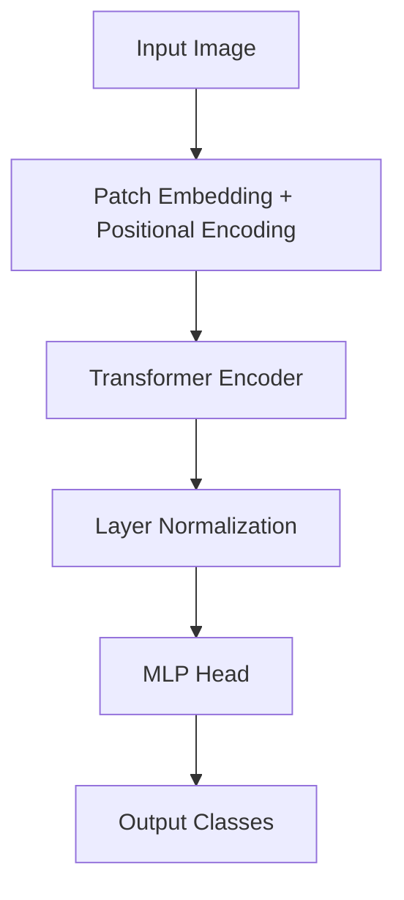

# Vision Transformer (ViT) Architecture Replication

## Project Overview

This project is a complete replication and implementation of the **Vision Transformer (ViT)** architecture, as presented in the groundbreaking paper "[An Image is Worth 16x16 Words: Transformers for Image Recognition at Scale](https://arxiv.org/abs/2010.11929)" by Alexey Dosovitskiy et al.

The primary goal of this project was to translate the theoretical concepts of the Vision Transformer into functional, modular code. By building the entire architecture from the ground up, this work deepened my understanding of how Transformer models, traditionally dominant in Natural Language Processing, can be effectively adapted for complex computer vision tasks like image classification, moving beyond traditional convolutional neural networks.

## Key Features & Learning Outcomes

* **Modular Codebase:** The project is structured with modular functions for various components, including data loading, model definition, and training loops, enhancing readability and maintainability. This structure leverages `going_modular` principles for robust deep learning projects.
* **Patch Embedding:** Implementation of how an input image is split into fixed-size patches, linearly embedded, and combined with positional embeddings.
* **Positional Encoding:** Development of positional embeddings to retain spatial information of image patches, crucial for the Transformer's understanding of input sequence order.
* **Multi-Head Self-Attention (MHSA):** Core implementation of the self-attention mechanism, allowing the model to weigh the importance of different image patches relative to each other.
* **Transformer Encoder Block:** Construction of the full Transformer encoder, comprising MHSA, Layer Normalization, and a Multi-Layer Perceptron (MLP) block.
* **Classification Head:** Integration of a classification head on top of the Transformer encoder for image classification tasks.
* **Pure Transformer-based Vision Model:** Gaining practical experience in building a robust image classification model without convolutional neural networks.
* **Deep Learning Architecture Design:** Enhanced ability to design, implement, and debug complex deep learning architectures.

## Architecture Diagram (Conceptual)


## Technologies Used

* **Python**
* **PyTorch** (Version 2.6.0+cu124)
* **Torchvision** (Version 0.21.0+cu124)
* **torchinfo** (for model summary)
* **Matplotlib** (for visualization)
* **Custom `going_modular` and `helper_functions` modules** (for data setup, engine, and utilities)

## Setup and Installation

To run this project locally, follow these steps:

1.  **Clone the repository:**
    ```bash
    git clone [https://github.com/Naveen-DS08/ViT_paper_replication.git](https://github.com/Naveen-DS08/ViT_paper_replication.git)
    cd ViT_paper_replication
    ```
2.  **Create a virtual environment (recommended):**
    ```bash
    python -m venv venv
    source venv/bin/activate  # On Windows: venv\Scripts\activate
    ```
3.  **Install dependencies:**
    The notebook implicitly installs `torchinfo` and downloads `going_modular` and `helper_functions` from `https://github.com/mrdbourke/pytorch-deep-learning` if not found locally. For this notebook, ensuring PyTorch and Torchvision are installed should be sufficient, with the notebook handling the rest.
    ```bash
    pip install torch torchvision torchaudio --index-url [https://download.pytorch.org/whl/cu121](https://download.pytorch.org/whl/cu121) # or appropriate version for your CUDA/CPU setup
    ```
    (You might also need `pip install matplotlib` for visualization).

## Usage

The primary entry point is the Jupyter Notebook `ViT_paper_replication_pytorch.ipynb`. This notebook walks through the entire process from data preparation to model training and evaluation.

1.  **Open the Jupyter Notebook:**
    ```bash
    jupyter notebook ViT_paper_replication_pytorch.ipynb
    ```
2.  **Execute cells:** Run the cells sequentially to:
    * Set up the environment and device (CPU/CUDA).
    * Download the `pizza_steak_sushi` dataset.
    * Create `DataLoader` instances with image transformations (image size 224x224, batch size 32).
    * Visualize sample images.
    * (Presumably) Define, train, and evaluate the Vision Transformer model.

## Data

The project utilizes a `pizza_steak_sushi` image dataset, which is automatically downloaded from `https://github.com/mrdbourke/pytorch-deep-learning/raw/main/data/pizza_steak_sushi.zip` during execution.


## Future Enhancements

* Expand training to larger, more complex datasets (e.g., CIFAR-10, ImageNet subsets).
* Implement various data augmentation strategies.
* Explore different optimization algorithms and learning rate schedulers.
* Integrate with pre-trained Vision Transformer weights for fine-tuning.
* Develop a dedicated Python script (`.py` file) for the ViT model, separating it from the notebook for cleaner project structure.

## License

This project is open-source. Please refer to the specific licenses of any external libraries or resources utilized (e.g., PyTorch, torchvision, datasets).

---

**Naveen Babu S**
